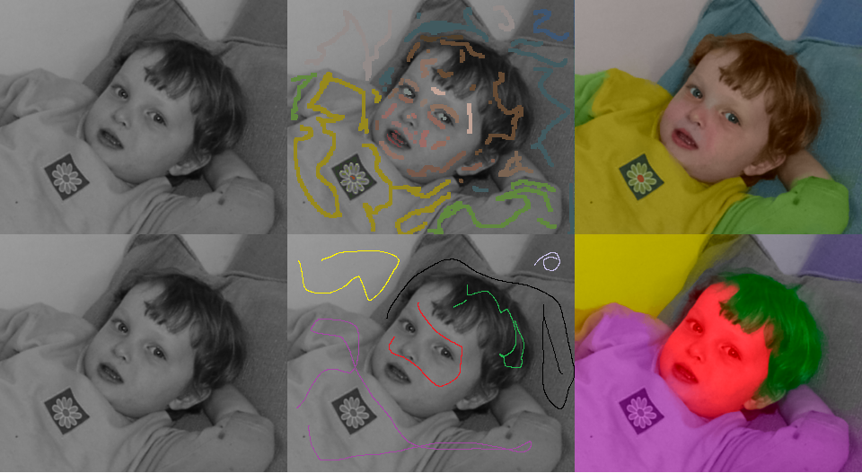
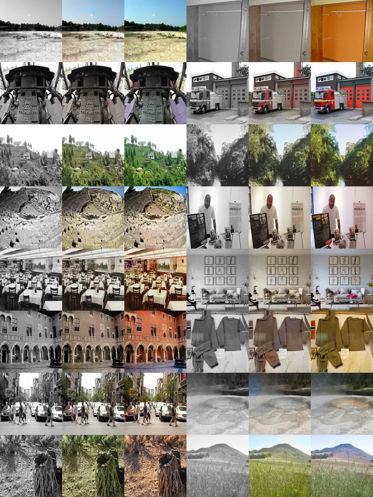
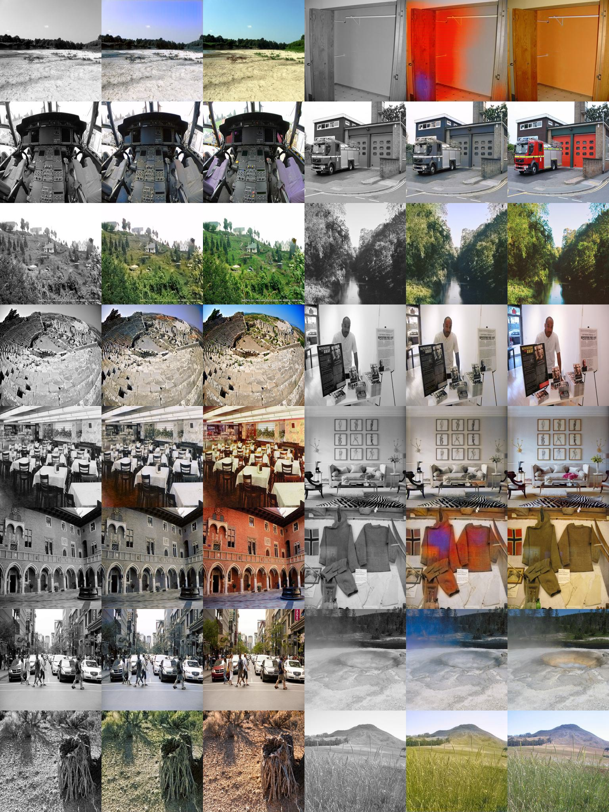

# Colorization
CV课程作业

#### 1 Colorization using Optimization

Levin A ,  Lischinski D ,  Weiss Y . Colorization using optimization[J]. ACM Transactions on Graphics (TOG), 2004.

#### 2 Let there be Color!: Joint End-to-end Learning of Global and Local Image Priors for Automatic Image Colorization with Simultaneous Classification

Satoshi Iizuka, Edgar Simo-Serra, and Hiroshi Ishikawa ACM Transaction on Graphics (Proc. of SIGGRAPH 2016), 2016

> Gray Input, Colorization, Ground Truth (10 epoches)

#### 3 Image-to-Image Translation with Conditional Adversarial Networks

Phillip Isola, Jun-Yan Zhu, Tinghui Zhou, Alexei A. Efros, CVPR, 2017.

> Gray Input, Colorization, Ground Truth (4 epoches)

#### 4 Denoising Diffusion Probabilistic Models

Ho, Jonathan and Jain, Ajay and Abbeel, Pieter, Advances in Neural Information Processing Systems, 2020

> Gray Input, Colorization, Ground Truth

